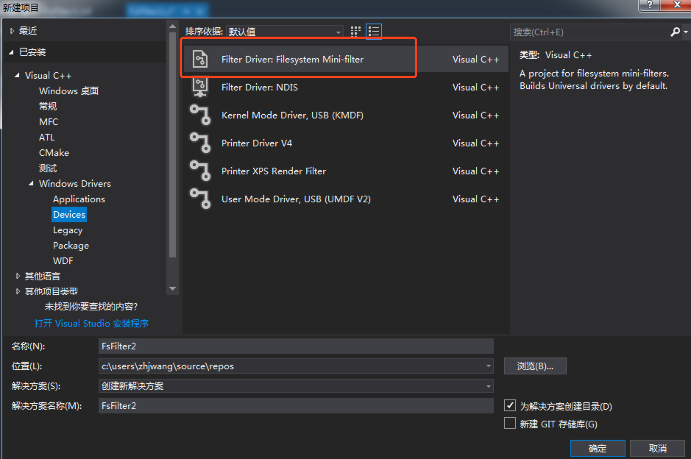
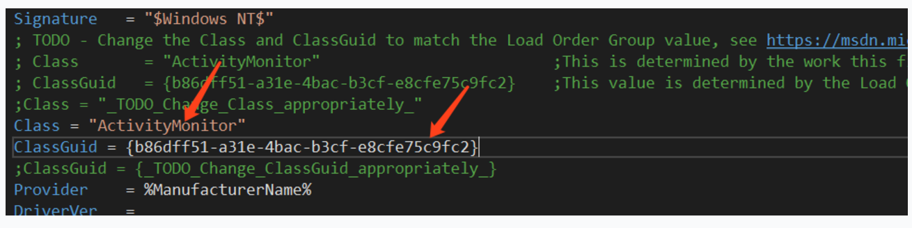

# windows基于minifilter文件系统过滤
之前在Linux上做过类似于过滤驱动相关的东西，那么对于windows上也有一套过滤驱动的框架，最简单易用的就是Minifilter.话说在Linux上开发，因为有源码，想怎么搞就怎么搞，你可以去看源码，但是在windows上没有源码给你看，但是框架接口都封装的比较健壮。本文将第一次使用minifilter对写操作进行过滤记录下来，也是一个备忘。

### 1.准备工作
在windows上开发内核态程序，离不开visual studio和wdk(windows driver kit).所以第一步当然是安装这连个工具。
安装也很简单，按照官网进行安装
```
https://docs.microsoft.com/en-us/windows-hardware/drivers/download-the-wdk
```
### 2.环境准备好，就可以开始写一个过滤驱动了
1.打开vs，文件，新建一个项目


2.然后在source file下面会自动生成过滤驱动的源文件。
在这个文件中输入以下代码（这个代码实现了对指定文件的写操作进行阻止的操作）
```

#include <fltKernel.h>
#include <dontuse.h>
#include <suppress.h>

PFLT_FILTER FilterHandle = NULL;

NTSTATUS MiniUnload(FLT_FILTER_UNLOAD_FLAGS flags);
FLT_PREOP_CALLBACK_STATUS MiniPostCreate(PFLT_CALLBACK_DATA Data, PCFLT_RELATED_OBJECTS FltObjects, PVOID *CompletionContext, FLT_POST_OPERATION_FLAGS Flags);
FLT_PREOP_CALLBACK_STATUS MiniPreCreate(PFLT_CALLBACK_DATA Data, PCFLT_RELATED_OBJECTS FltObjects, PVOID *CompletionContext);
FLT_PREOP_CALLBACK_STATUS MiniPreWrite(PFLT_CALLBACK_DATA Data, PCFLT_RELATED_OBJECTS FltObjects, PVOID *CompletionContext);

const FLT_OPERATION_REGISTRATION Callbacks[] = {

	{IRP_MJ_CREATE,0,MiniPreCreate,MiniPostCreate},
	{IRP_MJ_WRITE,0,MiniPreWrite,NULL},
	{IRP_MJ_OPERATION_END}  //struct end
};

const FLT_REGISTRATION FilterRegistration = {
	sizeof(FLT_REGISTRATION),
	FLT_REGISTRATION_VERSION,
	0,
	NULL,
	Callbacks, //imporant
	MiniUnload,
	NULL,
	NULL,
	NULL,
	NULL,
	NULL,
	NULL,
	NULL,
	NULL
};

NTSTATUS MiniUnload(FLT_FILTER_UNLOAD_FLAGS flags)
{
	KdPrint(("driver unload \r\n"));
	FltUnregisterFilter(FilterHandle);

	return STATUS_SUCCESS;
}

FLT_PREOP_CALLBACK_STATUS MiniPostCreate(PFLT_CALLBACK_DATA Data, PCFLT_RELATED_OBJECTS FltObjects, PVOID *CompletionContext, FLT_POST_OPERATION_FLAGS Flags)
{
	KdPrint(("post create is running \r\n"));
	return FLT_POSTOP_FINISHED_PROCESSING;

}

FLT_PREOP_CALLBACK_STATUS MiniPreCreate(PFLT_CALLBACK_DATA Data, PCFLT_RELATED_OBJECTS FltObjects, PVOID *CompletionContext)
{
	PFLT_FILE_NAME_INFORMATION FileNameInfo;
	NTSTATUS status;
	WCHAR Name[200] = { 0 };

	//GET FILE NAME
	status = FltGetFileNameInformation(Data, FLT_FILE_NAME_NORMALIZED | FLT_FILE_NAME_QUERY_DEFAULT, &FileNameInfo);

	if (NT_SUCCESS(status)) {
		status = FltParseFileNameInformation(FileNameInfo);
		if (NT_SUCCESS(status)) {
			if (FileNameInfo->Name.MaximumLength < 260) {
				RtlCopyMemory(Name, FileNameInfo->Name.Buffer, FileNameInfo->Name.MaximumLength);
				KdPrint(("create file :%ws \r\n", Name));
			}
		}
		FltReleaseFileNameInformation(FileNameInfo);
	}

	return FLT_PREOP_SUCCESS_WITH_CALLBACK;
}

FLT_PREOP_CALLBACK_STATUS MiniPreWrite(PFLT_CALLBACK_DATA Data, PCFLT_RELATED_OBJECTS FltObjects, PVOID *CompletionContext)
{
	PFLT_FILE_NAME_INFORMATION FileNameInfo;
	NTSTATUS status;
	WCHAR Name[200] = { 0 };

	//GET FILE NAME
	status = FltGetFileNameInformation(Data, FLT_FILE_NAME_NORMALIZED | FLT_FILE_NAME_QUERY_DEFAULT, &FileNameInfo);

	if (NT_SUCCESS(status)) {
		status = FltParseFileNameInformation(FileNameInfo);
		if (NT_SUCCESS(status)) {
			if (FileNameInfo->Name.MaximumLength < 260) {
				RtlCopyMemory(Name, FileNameInfo->Name.Buffer, FileNameInfo->Name.MaximumLength);
				_wcsupr(Name); //大小写转换
				if (wcsstr(Name, L"OPENME.TXT") != NULL)
				{
					KdPrint(("write file: %ws blocked \r\n"), Name);
					Data->IoStatus.Status = STATUS_ACCESS_DENIED;
					Data->IoStatus.Information = 0;
					FltReleaseFileNameInformation(FileNameInfo);
					return FLT_PREOP_COMPLETE; //it is equivalent to the IOcomplete

				}
				KdPrint(("create file :%ws \r\n", Name));
			}
		}
		FltReleaseFileNameInformation(FileNameInfo);
	}

	return FLT_PREOP_SUCCESS_NO_CALLBACK;  // No POST
}


NTSTATUS DriverEntry(PDRIVER_OBJECT DriverObject, PUNICODE_STRING Registrypath)
{
	NTSTATUS status;

	status = FltRegisterFilter(DriverObject, &FilterRegistration, &FilterHandle);

	if (NT_SUCCESS(status))
	{
		status = FltStartFiltering(FilterHandle);
		if (!NT_SUCCESS(status)) {

			//unregister our filter
			FltUnregisterFilter(FilterHandle);
		}

	}

	return status;
}
```

### 3.安装驱动前的操作
对新创建的这个项目进行设置
* 配置管理器->平台->x64
* c/c++  -> 警告等级（等级1）
* c/c++ -> 将警告视为错误（否）
* Linker ->将连接器的警告视为错误（选择否）
* Driver setting ->windows7

minifilter是基于inf这个配置文件的，所以还需要对这个文件进行配置

**设置1：**


**设置2：**
```
Instance1.Altitude       = "371000"
```

**设置3：**
```
LoadOrderGroup = "test"
```

### 4.设置好以上之后，就可以插入驱动了
**温馨提示：做windows驱动开发的时候，最后是使用两台机器，一个开发机，一个测试机。开发之后，将.inf文件和sys文件拷贝到测试机进行测试。因为有可能蓝屏导致系统无法启动，这样你的代码就出不来了。**

1.首先运行inf文件，右键安装即可。
2.然后插入驱动。以管理员的身份首先运行cmd命令行，在命令行下
```
net start FsFilter1
//FsFilter1和inf文件中的ServiceName保持一致
```
卸载一个驱动
```
net stop FsFilter1
```
在Windows上可以通过Debugview这个工具来查看内核输入的日志信息,在capture中勾上Capture kernel.
