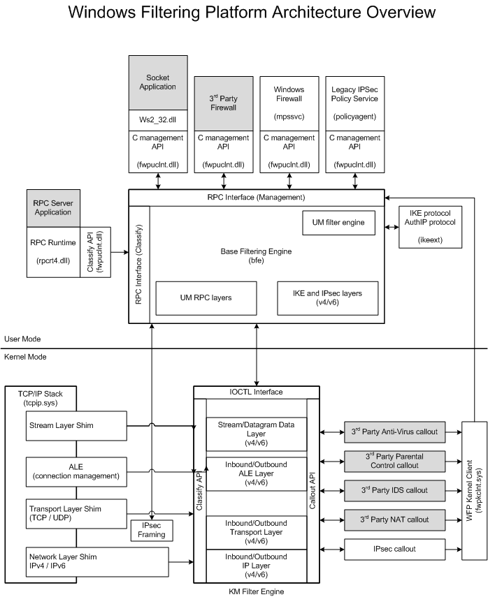

# windows基于wfp的网络过滤

WFP框架是一个windows上的网络数据包过滤框架。由两部分构成，一部分是用户态基础过滤引擎，一部分是内核态过滤引擎，。基础过滤引擎对上提供c调用方式的API以及RPC接口，这些接口封装在FWPCLNT.DLL模块中，开发者可以通过该模块的接口和基础过滤引擎进行交互，最终过滤模块，但是不论是使用用户态还是使用内核态的都最终会调用内核态的过滤引擎。

### 1.windows网络过滤模型
内核态过滤引擎是整个WFP框架的核心，相对基础过滤引擎更为复杂，首先内核过滤引擎需要和系统网络协议栈交互，通过一种称为“垫片”（shim）的内核模块从网络协议栈中获取网络数据，垫片被掺入到网络协议栈的各个层次中，不同的垫片获取到的数据不同，垫片获取到数据后，通过内核态过滤引擎提供的API，把数据传送到WFP的相应分层中。
内核态过滤引擎被分为若干个自层，在每个子层里，又可能分为一个或多个子层，子层是分层的更小划分，子层被分为不同的权重，在同一个子层中，WFP按照子层权重的大小顺序，从大到小把数据交给相应的子层。
另外在WFP中还存在一个Filter的概念，即定义过滤规则，开发者可以向WFP添加过滤条件。



### 2.wfp基本对象模型

#### 2.1 过滤引擎
内核态过滤引擎是整个wfp的核心，其内部被分为多个不同的层，不同的分层和网络协议栈不同的层次对应起来。这些层次通过垫片这种内核模块和网络协议栈关联起来。在每一个子层中又可以存在子层和过滤器。过滤器中定义了一组规则，用于对网络数据的阻断或者方形。
#### 2.2 垫片
垫片是windows一种特殊的内核模块，被安插在系统的网络协议栈中，主要作用是获取网络协议栈的数据。例如垫片被安插在传输层，可以获取TCP/UDP等协议数据；垫片被安插在网络层，可以获取IP协议的数据。当垫片获取到网络数据后，会通过WFP提供的API将数据数据传递给wfp.
垫片除了给wfp传递数据，还有个重要的作用就是把wfp的过滤结果再传送给网络协议栈，比如说，wfp要拦截某个网络数据，wfp把过滤结果传递给垫片后，垫片就可以直接拦截网络数据包。
在开发中，无需过多的关注垫片，对用户透明，只要集中处理网络数据包就好了。

#### 2.3 callout
呼出接口是WFP框架中重要的数据结构，也是对WFP能力的一种扩展。简单的来说，当网络数据命中某种过滤器的规则并且过滤器指定一个呼出接口时，该呼出接口内的回调函数就会被调用。呼出接口除了包含回调函数外，还包含一个GUID值，用来唯一的识别一个呼出接口。一般来说，不同的呼出接口的回调函数实现不同的功能。
在windows内核中，使用FWPS_CALLOUT来表示呼出接口，这是个宏，在win7之后的版本，是FWPS_CALLOUT1.在这个数据结构中，用calloutKey来唯一的表示这个呼出接口。

#### 2.4 分层
wfp分层的设计，相当于对网络数据进行了分类，开发者只需要对相应的分层进行交互即可。分层是一个容器，里面包含了一些过滤器。一般来说，把内核使用到的分层称为“运行时过滤分层标识”，把用户态使用到的分层标识称为“管理过滤分层标识”。
管理过滤分层标识：
```
FWPM_LAYER_INBOUND_IPPACKET_V4:接受IPV4网络数据包层
FWPM_LAYER_INBOUND_IPPACKET_V6:接受IPV6网络数据包层
FWPM_LAYER_OUTBOUND_IPPACKET_V4:发送IPV4网络数据包层
FWPM_LAYER_OUTBOUND_IPPACKET_V6:发送IPV6网络数据包层
```

#### 2.5 子层
在每个层中，又可以分为不同的子层（sub layer）,子层的划分是由开发者控制的。划分子层时需要给新的子层分配一个权重，权重的值越大，表明优先级越高。当有网络数据到达时，wfp会按照分层内的子层优先级顺序传递网络数据。子层的权重越大，越早接受到数据。
子层的定义为struct FWPM_SUBLAYER0.在这个结构体中subLayerKey表示唯一的表示一个子层，使用128位的GUID来表示。displayData显示数据：
```
struct FWPM_DISPLAY_DATA0_{
  wchar_t * name;
  wchar_t * description;
}
```
name指向的保存对象名字的缓冲区，description指向的是保存对象描述的缓冲区。
weight表示子层的权重。
#### 2.6 过滤器
过滤器存在于WFP的分层中。过滤器其实就是一套规则和动作的集合。规则指明了对哪些网络数据包感兴趣，即指明了需要对哪些网络数据包过滤，动作则是当数据包命中这些规则后，执行哪些操作。
开发者使用过滤器时，必须知道过滤器被添加到内核过滤引擎的哪一个分层中。并且在不同的分层中，不同过滤器的权重不能相同。
除此之外，过滤器还可以关联呼出接口。当过滤器的规则被命中时，wfp就会执行与该过滤器关联的呼出接口内的回调函数。在呼出接口内的回调函数中，可以对数据包内容进行深入的分析，根据分析情况返回过滤的结果。
在win7上，过滤器的数据结构定义为：
```
struct FWPM_FILTER0_{
  GUID filterKey; //过滤器的唯一标识，128位的GUID
  FWPM_DISPLAY-DATA0 displayData;//
  GUID layerKey; //分层的GUID,”管理过滤分层标识，表明被添加到哪一个分层
  GUID subLayerKey; //被添加到哪一个子层中。IID_NULL，被添加到默认的子层
  FWP_VALUE0 weight; //权重
  FWPM_FILTER_CONDITION; //这个过滤器的条件
  。。。。
}
```
过滤器的条件就涉及到了另外一个结构体，FWPM_FILTER_CONDITION。他可以指明这个过滤器要满足的条件。即要指明需要过滤的条件。
所以一个过滤器的添加如下：
```
NTSTATUS WfpAddFilter()
{
	FWPM_FILTER filter = { 0 };
	FWPM_FILTER_CONDITION condition[1] = { 0 };

	filter.displayData.name = L"FilterCalloutName";
	filter.displayData.description = L"FilterCalloutName";
	filter.layerKey = FWPM_LAYER_ALE_FLOW_ESTABLISHED_V4;
	filter.subLayerKey = WFP_SAMPLE_SUB_LAYER_GUID;
	filter.weight.type = FWP_EMPTY;
	filter.numFilterConditions = 1;
	filter.filterCondition = condition;
	filter.action.type = FWP_ACTION_CALLOUT_TERMINATING;
	filter.action.calloutKey = WFP_SAMPLE_ESTABLISHED_CALLOUT_V4_GUID;

	condition[0].fieldKey = FWPM_CONDITION_IP_LOCAL_PORT;

	condition[0].matchType = FWP_MATCH_LESS_OR_EQUAL;
	condition[0].conditionValue.type = FWP_UINT16;
	condition[0].conditionValue.uint16 = 65000;

	return FwpmFilterAdd(EngineHandle, &filter, NULL, &filterid);
}
```
#### 2.7 呼出接口函数
呼出接口函数作为呼出接口最重要的部分，是呼出接口功能实现的主题。呼出接口内部包含三个函数：notifyFn、classifyFn和flowDeleteFn.
对于classifyFn函数，当一个过滤器关联了呼出接口，并且规则被命中时，wfp就会调用呼出接口内的classifyFn函数，开发者可以在classifyFn函数内获取网络数据包的相关信息，具体信息取决于过滤器所在的分层，classifyFn还可以设置对网络数据包的**允许和拦截**操作。下面实现一下这个函数
```
VOID FilterCallback(const FWPS_INCOMING_VALUES0* Values,
	const FWPS_INCOMING_METADATA_VALUES0 * Metadata,
	PVOID layerdata,
	const void * context,
	const FWPS_FILTER * filter,
	UINT64 flowcontext,
	FWPS_CLASSIFY_OUT * classifyout)
{
	FWPS_STREAM_CALLOUT_IO_PACKET * packet;
	FWPS_STREAM_DATA *streamdata;

	KdPrint(("data is here\r\n"));

	packet = (FWPS_STREAM_CALLOUT_IO_PACKET *)layerdata;
	streamdata = packet->streamData;

	RtlZeroMemory(classifyout, sizeof(FWPS_CLASSIFY_OUT));

	/*if ((streamdata->flags & FWPS_STREAM_FLAG_SEND) || (streamdata->flags & FWPS_STREAM_FLAG_SEND_EXPEDITED)
	|| (streamdata->flags & FWPS_STREAM_FLAG_RECEIVE_EXPEDITED)) {

	goto end;
	}*/

	packet->streamAction = FWPS_STREAM_ACTION_NONE;
	classifyout->actionType = FWP_ACTION_PERMIT;

	if (filter->flags & FWPS_FILTER_FLAG_CLEAR_ACTION_RIGHT) {
		classifyout->actionType &= FWPS_RIGHT_ACTION_WRITE;
	}

}

```

###  3.通过以上分析
实现一个wfp，一般分为以下几个步骤
* 1.定义一个或者多个呼出接口，然后向wfp注册呼出接口。
* 2.添加第1步呼出接口到过滤引擎，
* 3.设计一个或者多个子层，把子层添加到分层中。
* 4.设计过滤器，把呼出接口，子层，分层和过滤器关联起来，向过滤引擎添加过滤器。
用代码体现为：
```
NTSTATUS InitializeWfp()
{
    if (!NT_SUCCESS(WfpOpenEngine())) {
        goto end;
    }

    //regist call out
    if (!NT_SUCCESS(WfpRegisterCallout())) {
        goto end;
    }

    if (!NT_SUCCESS(WfpAddCallout())) {
        goto end;
    }

    if (!NT_SUCCESS(WfpAddSublayer())) {
        goto end;
    }

    if (!NT_SUCCESS(WfpAddFilter())) {
        goto end;
    }

    return STATUS_SUCCESS;
end:
    UnInitWfp();
    return STATUS_UNSUCCESSFUL;
}
```
当然对于每一步，wfp都提供了相关的API，开发者可以参考官方文档，直接使用即可。
